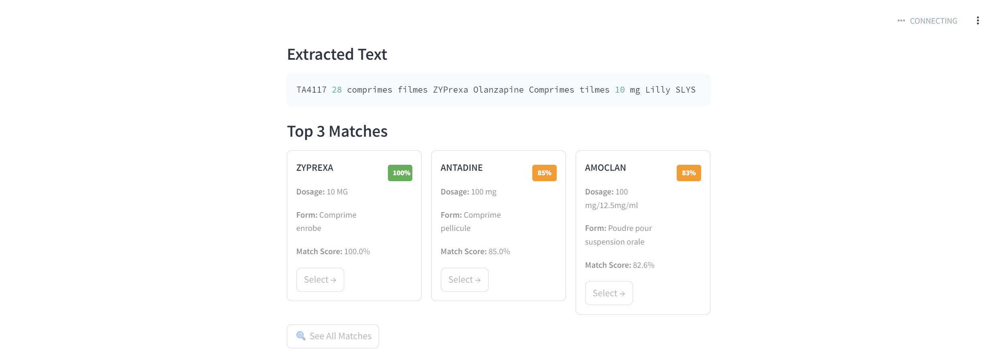

# 💊 Smart Medication Scanner


The **Smart Medication Scanner** is an AI-powered application that helps users identify medications by analyzing images of medication packages. It uses OCR (Optical Character Recognition) to extract text from images and matches it against a database of medications. The app also provides detailed information about the medication, including dosage, form, and potential drug interactions.
)  
*Demo: Smart Medication Scanner Interface*
![OCR Text Extraction Example]
*Demo: OCR Text Extraction*
![OCR Text Extraction Example])
*Demo: OCR Text Extraction*
## Features
- **Image Upload**: Upload an image of a medication package.
- **OCR Text Extraction**: Automatically extracts text from the image.
- **Fuzzy Matching**: Matches extracted text against a database of medications.
- **Top 3 Matches**: Displays the top 3 matches with confidence scores.
- **See All Matches**: Option to view all matches.
- **Medication Details**: Provides detailed information about the selected medication.
- **Drug Interactions**: Checks for potential drug interactions using the OpenFDA API.


## Installation

### Prerequisites
- Python 3.8 or higher
- System dependencies (if any): See `packages.txt`.

### Setting Up the Project

1. **Clone the Repository:**
   ```bash
   git clone https://github.com/SemerNahdi/-Smart-Medication-Scanner
   ```
    ```bash
   cd medication-scanner
   ```

2. **Create a Virtual Environment:**
   To isolate your dependencies, create a virtual environment. Replace `discovery` with your desired environment name if needed.
   ```bash
   python -m venv discovery
   ```

3. **Activate the Virtual Environment:**
   - On Windows:
     ```bash
     .\discovery\Scripts\activate
     ```
   - On macOS/Linux:
     ```bash
     source discovery/bin/activate
     ```

4. **Install Python Dependencies:**
   Install the required Python packages listed in `requirements.txt`:
   ```bash
   pip install -r requirements.txt
   ```

### Running the Application

Once everything is set up, you can run the application using Streamlit:

```bash
streamlit run app.py
```

### Usage

1. Open the app in your browser (Streamlit should automatically provide a local URL).
2. Upload an image of a medication package.
3. Review the extracted text and suggested matches.
4. Select a match to view detailed information.
5. Confirm your selection to see drug interactions and other details.

### Database

The app uses an Excel file (`medications.xltx`) as the medication database. Ensure the file is placed in the project directory and contains the following columns:

- **Nom** (Name)
- **Dosage**
- **Forme** (Form)
- **DCI** (Active Ingredient)
- **Other relevant fields** (e.g., Laboratoire, AMM, etc.)

### API Key

To enable drug interaction checks, sign up for an API key from OpenFDA and replace the placeholder in the code:

```python
OPENFDA_API_KEY = "your-api-key-here"
```

## Folder Structure

After setting up the project, your folder structure should look like this:

```
medication-scanner/
├── app.py
├── requirements.txt
├── README.md
├── medications.xltx
```

## License

This project is licensed under the MIT License. See the LICENSE file for details.


For example:

